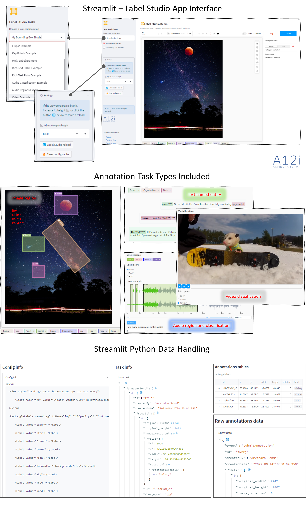

# Streamlit - Label Studio Frontend

_**A Streamlit component integrating Label Studio Frontend in Streamlit applications**_

    date: "2022-06-14"
    author:
        name: "Arvindra Sehmi"
        url: "https://www.linkedin.com/in/asehmi/"
        mail: "vin [at] thesehmis.com"
        avatar: "https://twitter.com/asehmi/profile_image?size=original"
    related: [Introduction to Streamlit and Streamlit Components](https://auth0.com/blog/introduction-to-streamlit-and-streamlit-components/)

## Overview

[Label Studio](https://labelstud.io/) is an open source data labeling tool providing flexible data annotation. Label Studio comprises Label Studio Backend (LSB) server and ML service and 
Label Studio Frontend (LSF) which is based on React and mobx-state-tree and distributed as an NPM package. LSF can be integrated in third-party applications
without using LSB to provide data annotation support to users. LSF can be customized and extended to build custom UIs or used with pre-built labeling templates. 

This Streamlit application leverages Streamlit Components extensibilty with the simple architecture of _Component Zero_ discussed in my article, 
[Introduction to Streamlit and Streamlit Components](https://auth0.com/blog/introduction-to-streamlit-and-streamlit-components/). Using _Component Zero_
as a template it was straight-forward to take the code snippet in Label Studio's [Frontend integration guide](https://labelstud.io/guide/frontend.html#Frontend-integration-guide)
and build the Streamlit component.

### What's in the demo app



### Demo app


### Try the demo app yourself

[](https://share.streamlit.io/asehmi/streamlit-label-studio-frontend/app.py)

## Installation

```bash
$ cd streamlit-label-studio-frontend
$ pip install -r requirements.txt
```

## Usage

Run the included app for a quick example of how the LSF Streamlit component I built works:

```bash
$ streamlit run app.py
```

The Streamlit user interface is used to load any supported annotation task configurations which Label Studio Frontend uses to display annotation tools appropriate for the annotation task at hand. Once annotations are done, the annotations data can be submitted via the custom LSF Streamlit component to Streamlit, where it is displayed. You can of course extend the Streamlit application and store or export this data as you see fit. You can leverage LSB API from Streamlit, though that is out of scope for this demo app.

The demo app is easily customised through externalized configuration files.

## Configuration

Configuration for labeling tasks in made in [`app_configs.json`](https://github.com/asehmi/streamlit-label-studio-frontend/blob/master/app_configs.json). There are three sections required for annotation: `"user"`, `"interfaces"` and `"task_configs"`.

In `"task_configs"` you define `"task"` objects explicitly using the task `"object"` key, or via a local file using the task `"file"` key, or from an external site using the task `"url"` key. Similarly, you can define Label Studio annotation UI elements using `"config"` objects.

Below are some examples:

**./app_configs.json**

```json
{ 
    "user" : {
        "pk": 1,
        "firstName": "Arvindra",
        "lastName": "Sehmi"
    },

    "interfaces": [
        "panel",
        "update",
        "submit",
        "skip",
        "controls",
        "infobar",
        "topbar",
        "instruction",
        "side-column",
        "annotations:history",
        "annotations:tabs",
        "annotations:menu",
        "annotations:current",
        "annotations:add-new",
        "annotations:delete",
        "annotations:view-all",
        "predictions:tabs",
        "predictions:menu",
        "auto-annotation",
        "edit-history"
    ],
    
    "task_configs": [
        {
            "name": "My Bounding Box Single",
            "description": "My Bounding Box Single Image Annotation",
            "annotation_type": "image",
            "config": { 
                "file": "./label_studio_configs/xml/bounding_box_config.xml" 
            },
            "task": {
                "object": {
                    "annotations": [],
                    "predictions": [],
                    "id": 1,
                    "data": {
                        "image": "https://htx-misc.s3.amazonaws.com/opensource/label-studio/examples/images/nick-owuor-astro-nic-visuals-wDifg5xc9Z4-unsplash.jpg"
                    }
                }
            }
        },
        {
            "name": "My Bounding Box Multi",
            "description": "My Bounding Box Multiple Images Annotation",
            "annotation_type": "image",
            "config": { 
                "file": "./label_studio_configs/xml/example_bounding_box_config.xml" 
            },
            "task": {
                "file": "./label_studio_configs/json/example_tasks.json" 
            }
        },
        {
            "name": "Bounding Box Example",
            "description": "Bounding Box Image Annotation Example",
            "annotation_type": "image",
            "config": {
                "url": "https://raw.githubusercontent.com/heartexlabs/label-studio-frontend/master/examples/image_bbox/config.xml" 
            },
            "task": { 
                "url": "https://raw.githubusercontent.com/heartexlabs/label-studio-frontend/master/examples/image_bbox/tasks.json" 
            }
        }
    ]
}
```

**./label_studio_configs/xml/bounding_box_config.xml**

```xml
<View>
    <View style="padding: 25px; box-shadow: 2px 2px 8px #AAA;">
        <Image name="img" value="$image" width="100%" brightnessControl="true" contrastControl="true" zoomControl="true" rotateControl="true">
        </Image>
</View>
    <RectangleLabels name="tag" toName="img">
        <Label value="Galaxy"></Label>
        <Label value="Star"></Label>
        <Label value="Comet"></Label>
        <Label value="Moon"></Label>
        <Label value="Sky"></Label>
        <Label value="Tree"></Label>
        <Label value="Road"></Label>
        <Label value="Fence"></Label>
    </RectangleLabels>
</View>
```

**./label_studio_configs/json/example_tasks.json**

```json
[
    {
        "annotations": [],
        "predictions": [
            {
                "model_version": "model 1",
                "created_ago": "3 hours",
                "result": [
                    {
                        "from_name": "tag",
                        "id": "t5sp3TyXPo",
                        "source": "$image",
                        "to_name": "img",
                        "type": "rectanglelabels",
                        "value": {
                            "height": 11.612284069097889,
                            "rectanglelabels": [
                                "Moonwalker"
                            ],
                            "rotation": 0,
                            "width": 39.6,
                            "x": 13.2,
                            "y": 34.702495201535505
                        }
                    }
                ]
            },
            {
                "model_version": "model 2",
                "created_ago": "4 hours",
                "result": [
                    {
                        "from_name": "tag",
                        "id": "t5sp3TyXPo",
                        "source": "$image",
                        "to_name": "img",
                        "type": "rectanglelabels",
                        "value": {
                            "height": 33.61228406909789,
                            "rectanglelabels": [
                                "Moonwalker"
                            ],
                            "rotation": 0,
                            "width": 39.6,
                            "x": 13.2,
                            "y": 54.702495201535505
                        }
                    }
                ]
            }
        ],
        "id": 1,
        "data": {
            "image": "https://htx-misc.s3.amazonaws.com/opensource/label-studio/examples/images/history-in-hd-e5eDHbmHprg-unsplash.jpg"
        }
    },
    {
        "annotations": [],
        "predictions": [],
        "id": 2,
        "data": {
            "image": "https://htx-misc.s3.amazonaws.com/opensource/label-studio/examples/images/history-in-hd-e5eDHbmHprg-unsplash.jpg"
        }
    },
    {
        "annotations": [],
        "predictions": [],
        "id": 3,
        "data": {
            "image": "https://htx-misc.s3.amazonaws.com/opensource/label-studio/examples/images/soroush-karimi-crjPrExvShc-unsplash.jpg"
        }
    }
]
```

More configurations can be found in the official [Label Studio examples](https://github.com/heartexlabs/label-studio-frontend/tree/master/examples)

## Debugging

If you use vs-code, then I have included my `.vscode` launch settings. Turn on remote debugging in `app.py` by setting the debug flag in the statement below to `True`. You can adjust the `port` setings here too, but also remember to do the same in `launch.json`.

```python
streamlit_debug.set(flag=False, wait_for_client=True, host='localhost', port=6789)
```

A major benefit I found building a static HTML Streamlit component was that it can be debugged very easily using a browser's developer tools. This is in contrast to the obscure debugging experience you encounter using more sophisticated web frameworks.

## Label Studio resources

- [Website](https://labelstud.io/)
- [Frontend docs](https://labelstud.io/guide/frontend.html)
- [Frontend repo](https://github.com/heartexlabs/label-studio-frontend)
- [Backend repo](https://github.com/heartexlabs/label-studio)
- [v1.4.0 on NPM](https://www.npmjs.com/package/@heartexlabs/label-studio)

---

If you enjoyed this app, please consider starring this repository.

Thanks!

Arvindra